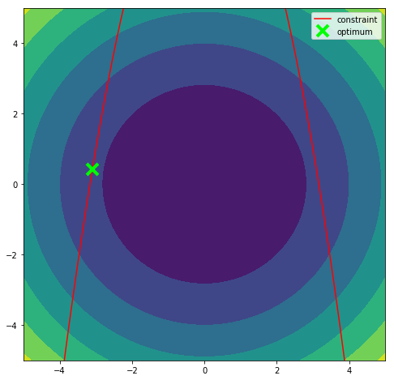

# Leap Frog Optimizer Package - Lite Edition

- Author  : Mark Redd
- Email   : redddogjr@gmail.com
- GitHub  : https://github.com/flythereddflagg
- Website : http://www.r3eda.com/

### About:

This package is based the 
<em><a href="http://www.r3eda.com/leapfrogging-optimization-algorithm/">Leapfrogging Optimization 
Algorithm</a></em>
published by 
<a href="http://www.r3eda.com/about-russ/">Dr. R. Russell Rhinehart</a>.

The following publications explain the technique and may be found on the website:
  - Rhinehart, R. R., M. Su, and U. Manimegalai-Sridhar,
    “Leapfrogging and Synoptic Leapfrogging: a new optimization approach”,
    Computers & Chemical Engineering, Vol. 40, 11 May 2012, pp. 67-81.
  - Manimegalai-Sridhar, U., A. Govindarajan, and R. R. Rhinehart,
    “Improved Initialization of Players in Leapfrogging Optimization”,
    Computers & Chemical Engineering, Vol. 60, 2014, 426-429.
  - Rhinehart, R. R.,
    “Convergence Criterion in Optimilsation of Stochastic Processes”,
    Computers & Chemical Engineering, Vol. 68, 4 Sept 2014, pp 1-6.

This is the stripped down version of the package with minimal tools. It is written in pure Python to allow compatibility
for the alpha versions until the full version can be released.

## Installation 

You can install the lite versions via pip or using the setup.py script in the source code. Instructions are shown below.

**System requirements for installation:**

 - Python >= 3.6
 - `numpy`
 - `scipy`
 - `nose`

#### Via pip

Lpfgopt may be installed with pip using the following command:
```bash
$ pip install lpfgopt-lite # You may need root privileges or the --user tag
```

If you wish to install locally with pip you may do the following:
- Download the 'lite' branch and unzip the archive or clone it with git.
- Open the main directory where "setup.py" is located and run the following command:
  ```bash
  $ pip install .
  ```
#### Via setup.py
- Download the 'lite' branch and unzip the archive or clone it with git.
- Open the main directory where "setup.py" is located and run the following command:
  ```bash
  $ python setup.py install     # You may need root priviliges or use the --user tag
  ```
The software should be installed correctly. You may validate the installation by executing the following commands:
```python
$ python
>>> import lpfgopt
>>> lpfgopt.__version__
'X.X.X'
>>> lpfgopt.minimize(lambda x: x[0]**2 + 10, [[-10, 10]])['x']
[<approximately 0.0>]
>>>
```
If the above commands produce the output congratulations! You have successfully installed the package!
## Usage
Use the `lpfgopt.minimize` function to solve optimization problems of the form:
```
minimize f(x)
subject to:
	g(x) <= 0
	bound[0][0] <= x[0] <= bound[0][1]
	bound[1][0] <= x[0] <= bound[1][1]
	...
	bound[n][0] <= x[0] <= bound[n][1]

where n is the number of decsision variables and bound
is a n X 2 list of lists or 2d numpy array with shape (n,2)
```
### `lpfgopt.minimize` documentation

**lpfgopt.minimize(** *fun, bounds, args=(), points=20, fconstraint=None, discrete=[], maxit=10000, tol=1e-5, seedval=None, pointset=None, callback=None* **)**

*General-use wrapper function to interface with the LeapFrog optimizer class.*
*Contains the data and methods necessary to run a LeapFrog optimization.*
*Accepts constraints, discrete variables and allows for a variety of options.*

- **Parameters:**        
  - **fun : callable** Objective function 
  - **bounds : array-like, shape (n, 2)** Decision variable upper and lower bounds
  - **args : iterable** Other arguments to be passed 
  into the function
  - **points : int** Point set size
  - **fconstraint : callable** Constraint function of the form g(x) <= 0
  - **discrete : array-like** List of indices that correspond to 
  discrete variables. These variables
  will be constrained to integer values
  by truncating any randomly generated
  number (i.e. rounding down to the 
  nearest integer absolute value)
  - **maxit : int** Maximum iterations
  - **tol : float** Convergence tolerance
  - **seedval : int** Random seed
  - **pointset : array-like, shape (m, n)** Starting point set
  - **callback : callable** Function to be called after each iteration
  
- **Returns:**
  
  - **solution : dict** A dictionary containing the results of the optimization.
       The members of the solution are listed below.
       - **x : list** 
         The solution vector or the vector of 
         decision variables that produced the lowest 
         objective function value
       - **success : bool**
         Whether or not the optimizer exited successfully.
       - **status : int**
         Termination status of the optimizer. Its value 
         depends on the underlying solver. Refer to 
         message for details.
       - **message : string**
         Description of the cause of the termination.
       - **fun: float**
         The objective function value at 'x'
       - **nfev : int**
         The number of function evaluations of the objective
         function
       - **nit : int**
         The number of iterations performed
       - **maxcv : float**
         The maximum constraint violation evaluated during
         optimization
       - **best : list** 
         The member of the population that had the lowest
         objective value in the point set having the form
         `[f(x), x[0], x[1], ..., x[n-1]]`
       - **worst : list**
         The member of the population that had the highest
         objective value in the point set having the form
         `[f(x), x[0], x[1], ..., x[n-1]]`
       - **final_error : float**
         The optimization convergence value upon termination
       - **pointset :  list, shape(m, n)** The entire point set state upon termination having 
         the form:
         ```
          [
          [f(x[0]),   x[0][0],   x[0][1],   ..., x[0][n-1]],
          [f(x[1]),   x[1][0],   x[1][1],   ..., x[1][n-1]],
          ...,
          [f(x[m-1]), x[m-1][0], x[m-1][1], ..., x[m-1][n-1]]
          ]
         ```
         where n is the number of decision variables and m 
          is the number of points in the search population.

#### Example Usage
The following is a simple optimization where the minimum value of the following equation is found:  
 - $f(x) = x^2+y^2$
 - Subject to: $g(x) = -x^2 - y + 10 \le 0$ **or** g(x) = -x^2 - y + 10 <= 0
```python
# test_lpfgopt.py
from lpfgopt import minimize
import matplotlib.pyplot as plt

# set up the objective funciton, 
# constraint fuction and bounds
f = lambda x: sum([i**2 for i in x])
g = lambda x: -x[0]**2 + 10 - x[1] 
bounds = [[-5,5] for i in range(2)]

# run the optimization
sol = minimize(f, bounds, fconstraint=g)['x']
print(f"Solution is: {sol}")

# plot the results on a contour plot
gg = lambda x: -x**2 + 10 # for plotting purposes

plt.figure(figsize=(8,8))
x, y = np.linspace(-5,5,1000), np.linspace(-5,5,1000)
X, Y = np.meshgrid(x,y)
Z = f([X,Y])

plt.contourf(X,Y,Z)
plt.plot(x, gg(x), "r", label="constraint")
plt.plot(*sol, 'x', 
         markersize=14, 
         markeredgewidth=4, 
         color="lime", 
         label="optimum")
plt.ylim(-5,5)
plt.xlim(-5,5)
plt.legend()
plt.show()
```
This code will produce the following output:
```bash
Solution is: [-3.0958051486911997, 0.4159905027317925]
```
As well as a plot that should look similar to the following image:


